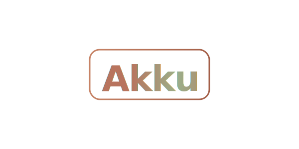
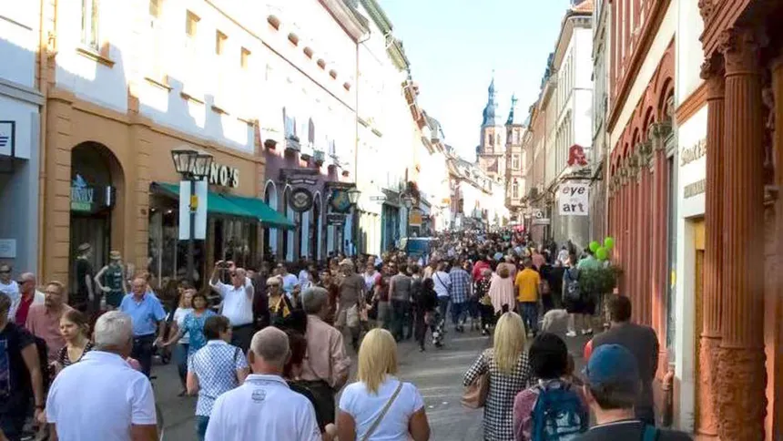

<!-- _class: lead -->

#
<!-- Uncomment the logo below to use the Akku SVG logo instead of the text title on the first slide.
You can enable either the Markdown image or the HTML  tag depending on your needs. -->

<!-- {width=60%} -->

<!-- Original H1 (commented out while logo is preferred) -->
<!-- # Akku -->
## Energie für lokale Gemeinschaften.
<!-- Digitale Infrastruktur für lokale Wirtschaft und Gemeinschaft   -->
#### Präsentation für das *vielmehr*-Programm – Heidelberg

Dr. Stefano Balietti

---

## Dr. Stefano Balietti

Gründer von **Akku** | Forscher & Civic-Technologist  

- Promotion in **Computational Social Science (ETH Zürich)**  
- Forschungserfahrung an **Harvard, Microsoft, Northeastern (Boston), Uni Mannheim & Heidelberg**  
- Gründer mehrerer Open-Source- und Civic-Tech-Projekte (z. B. *EduCERT*, *nodeGame*)  
- Forschung zu **Vertrauen, Partizipation und digitalen Gemeingütern**  

<!-- > *„Digitale Infrastruktur sollte Menschen und lokale Gemeinschaften stärken – nicht Plattformen.“* -->

---

## **Vision**

> **Energie für lokale Wirtschaft und Gemeinschaft.**

- Akku verbindet **digitale Zahlungen, lokale Loyalität und soziale Teilhabe**.  

Wir schaffen eine Plattform, die Städte, Bürger:innen und kleine Unternehmen digital stärkt

- Ein Beitrag zu nachhaltigen, resilienten Stadtökosystemen.

---

## **Problem**

- **Kleine Unternehmen (KMU)** sind Rückgrat der Wirtschaft, aber:  
  - Hohe Zahlungsgebühren (1,5–3 %)  
  - Geringe digitale Sichtbarkeit  
  - Abhängigkeit von globalen Plattformen  

- **Bürger:innen** wünschen sich lokale Angebote, aber finden sie digital kaum.  

 **Kommunen** brauchen Werkzeuge, um Teilhabe und lokale Wirtschaft zu fördern.
 
 ---
 
 # Altstadt
 
 
 
 ---
 
 ## Aber warum nur socken Laden? 
 (Hat mein Bruder gesagt bei letzten besuch)
 
 

 
 
 
 
 
 <!-- 
 
  -->
 
 

 
 ---
 
 ## **Die Lösung: Akku**
 
 Eine **mobile App für lokale Wirtschaftsförderung und Gemeinschaftsbildung.**
 
 

### Für Bürger:innen  
- Einfaches, gebührenfreies Bezahlen  
- Bonusprogramme & Gemeinschaftsziele  
- Unterstützung lokaler Geschäfte durch „Aufladen"

### Für Unternehmen  
- Sofortige Liquidität durch Prepaid-Zahlungen  
- 0 % Kreditkartengebühren (Open Banking)  
- Automatisierte Loyalitätsprogramme  
- Sichtbarkeit in der lokalen Akku-Community

---

## **Wie Akku funktioniert**

1. **Kund:innen “laden” ihr Lieblingsgeschäft auf** – wie ein digitales Guthaben.  
2. **Das Geschäft erhält sofort Liquidität** und kann Boni oder gemeinsame Ziele definieren.  
3. **Gemeinschaftliche Anreize**: Boni werden freigeschaltet, wenn alle gemeinsam Umsätze steigern.  
4. **Lokale Identität & Datenschutz**: Jede Nutzer:in erhält eine verschlüsselte, DSGVO-konforme Wallet-ID.  

> Ein digitales Ökosystem, in dem Energie und Vertrauen lokal zirkulieren.

---

## **Technische Innovation**

- **Open Banking**: 95 % geringere Transaktionskosten als Kreditkarten  
- **Kryptographische Identitäten**: sicher, zukunftsfähig, nicht fälschbar  
- **Voucher-Modell**: fällt unter deutsches Gutscheinrecht – keine Banklizenz nötig  
- **Modular & interoperabel**: API für Drittanbieter, einfache Integration für Städte  

Technologie aus dem Forschungsprojekt **EduCERT (Uni Mannheim)** – Blockchain-Identitäten mit Datenschutz by Design.

---

## **Soziale Innovation**

- Vom **individuellen Punktesammeln** zur **kollektiven Belohnung**  
- Motivation durch **soziale Ziele & Gamification**  
- **Lokaler Zusammenhalt** statt Plattformabhängigkeit  
- Förderung von **Nachhaltigkeit und Fairness** in Konsum und Wirtschaft  

> Akku verwandelt lokale Einkäufe in gemeinschaftliche Aktionen.

---

## **Akku und „vielmehr“**

- Stärkt **soziale Innovation und Nachbarschaftsinitiativen**  
- Verbindet **lokale Unternehmen, Bürger:innen und Verwaltung**  
- Unterstützt **digitale Teilhabe** in Heidelberg  
- Kompatibel mit **städtischen Nachhaltigkeitszielen (SDG 8, 9, 11)**  
- Ermöglicht **Datensouveränität und offene Schnittstellen**  

> Akku kann die digitale Infrastruktur des „vielmehr“-Programms ergänzen und erweitern.

<!-- ---

## **8. Pilotprojekt Heidelberg**

📍 **Startregion:** Heidelberg – ideale Testumgebung  
- 7.000+ lokale KMU  
- 39.000 Studierende  
- Hohe Digitalaffinität  

### Geplanter Ablauf:
1. **Pilotphase** in zwei Stadtteilen (z. B. Neuenheim, Bahnstadt)  
2. Kooperation mit **lokalen Läden, NGOs, Studierendeninitiativen**  
3. **Co-Creation**-Workshops mit Verwaltung und Zivilgesellschaft  
4. **Evaluation** von sozialer Wirkung & Vertrauen -->

---

## ** Wirkung & Nachhaltigkeit**

- 🌱 **Wirtschaftlich** – stärkt lokale Betriebe, reduziert Gebühren  
- 🧑‍🤝‍🧑 **Sozial** – fördert Zusammenhalt und Teilhabe  
- ♻️ **Ökologisch** – spart Papier, Plastik und Wege  
- 🧭 **Digital souverän** – offenes, europäisches Civic-Tech-Modell  

> Akku trägt zu Heidelbergs Ziel einer sozial-ökologischen Stadtgesellschaft bei.

---

## **10. Nächste Schritte**

1. **Austausch mit dem vielmehr-Team**  
2. **Gemeinsame Pilotplanung** mit ausgewählten Stadtteilen  
3. **Technische Integration & Workshopreihe**  
4. **Start der Beta-Phase (3 Monate)**  
5. **Evaluation & Skalierung**

---

## **Kontakt**

**Akku Projektteam**  
🌐 [akku.network](https://akku.network)  
✉️ hello@akku.network  

**Dr. Stefano Balietti**  
📍 Heidelberg | Civic Tech & Digital Governance  

> *Akku – Energie für lokale Gemeinschaften.*
