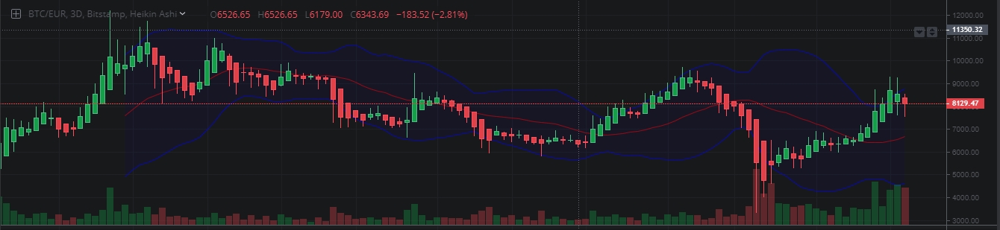
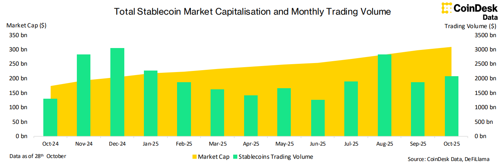
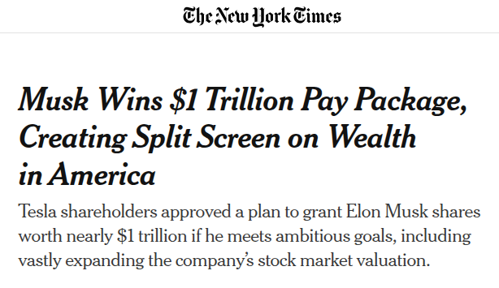
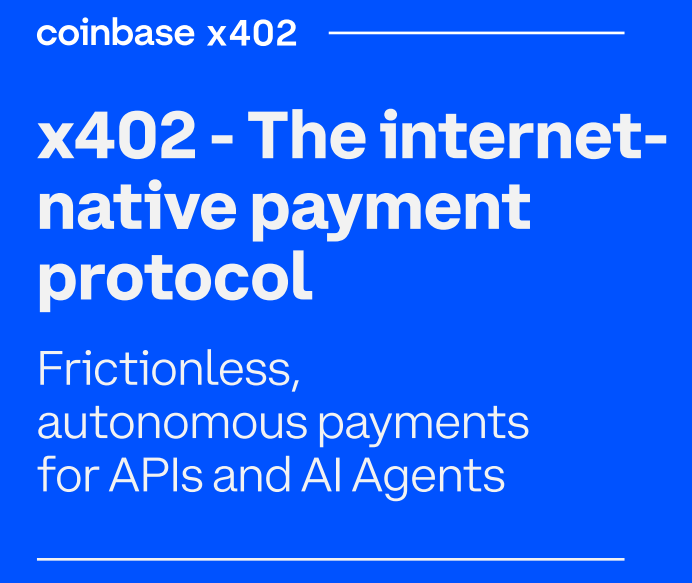

# Lecture 5: On-chain Agentic Micropayments
## _Dr. Stefano Balietti_  


<!-- (https://marp.app/assets/marp.svg) -->


---

# Warm-up 


<!-- (https://assets1.ignimgs.com/2020/10/31/0-signed-photo-of-sean-connery-posing-as-james-bond-1280x720-1604162798616.jpg)  -->

**What did we learn last week?**

- What is an agent?


<!-- An AI agent is a software system that can perceive its environment, reason or decide based on those perceptions, and then act autonomously toward achieving a goal.

Formally, from AI theory:

An agent is anything that perceives its environment through sensors and acts upon that environment through actuators.
(Russell & Norvig, “Artificial Intelligence: A Modern Approach”)

When we say AI agent today, especially in the LLM era, we mean:

A program that uses artificial intelligence models (like GPTs or other ML models) to make context-aware decisions and perform goal-directed actions, often interacting with APIs, tools, or other systems. -->

---

<!-- # Refresher: Components of an AI Agent


---

# Refresher: Components of an AI Agent


- **Model**: GPT-4, Llama, Claude...

- **Tools**: External systems and interfaces the agent can interact with, such as web search, code execution environments, calculators, or image generators. 

- **Memory**:
  - Short-term (working) memory: Maintains context within a single session or conversation for coherence and reasoning. [mem0](https://mem0.ai/blog/memory-in-agents-what-why-and-how)

  - Long-term memory: Persists information across sessions and tasks, supporting user personalization, context continuity, and history recall.


--- -->

# Refresher: Components of an AI Agent

1. **Reasoning/Generation**: Provide natural language understanding and synthesis, usually an LLMs (e.g., Llama, Claude).

2. **Policy/Planner**: Structures work into actionable steps, enabling the agent to manage complex objectives, not just answer atomic queries.​

3. **Tools**: Lets the agent interact with and manipulate resources outside its own knowledge for tasks requiring real-time data.​

4. **Retriever**: Provides rapid, targeted access to a broader or more current body of knowledge than the LLM’s static context.

---

<!-- # Refresher: Components of an AI Agent


---

# Refresher: Components of an AI Agent


- **Model**: GPT-4, Llama, Claude...

- **Tools**: External systems and interfaces the agent can interact with, such as web search, code execution environments, calculators, or image generators. 

- **Memory**:
  - Short-term (working) memory: Maintains context within a single session or conversation for coherence and reasoning. [mem0](https://mem0.ai/blog/memory-in-agents-what-why-and-how)

  - Long-term memory: Persists information across sessions and tasks, supporting user personalization, context continuity, and history recall.


--- -->

## Agent Demo from last week

Follow the instructions in the Github repo of the last lecture to try it.

---


## What Component is Missing in our Agent?


---

## What Component is Missing in our Agent ?


5. **Wallet**: Allows agents to spend to acquire information, services, and goods.


---


---

## Reflect: How would AI agents with payments change your life?


<!-- --- -->

<!-- ---

## What about this number?

<div style="margin-top: 0%; font-size:400px;"><strong>x</strong>402</div> -->

<!-- ---


## Embed video

<video controls width="600">
    <source src="example.mp4" type="video/mp4">
</video>

---

## JavaScript example
<div id="chart"></div>
<script>
    document.getElementById('chart').innerHTML = '<b>Interactive chart here</b>';
</script> -->

---

# Today's Agenda

1. **The (micro)Payment Problem** - And 402
2. **Blockchain Basics** - Why it matters
3. **Stablecoins** - The building block of micropayments
4. **AI + Blockchain** - The convergence
5. **x402 Protocol** - Architecture & demo
6. **Economics, Risks & Future**


---

## Do you know this number?

<span style="margin-top: 0%; font-size:400px;">404</span>


---


---
## What about this number?

<span style="margin-top: 0%; font-size:400px;">402</span>


---
## 402 Response Demo

```http
HTTP/1.1 402 Payment Required
```

<!-- <span style="margin-top: 0%; font-size:400px;">402</span> -->
<a href="http://localhost:4021/paywall/">http://localhost:4031/paywall</a>
<div style="font-size:smaller">Follow the instructions in the Github repo of this lecture to try it.</div>


---

# The (micro)Payment Problem

- Not economically viable way to send them over the Internet
- Intermediaries charge **high fees** (2-3%) and offer **slow settlement** (2-5 days)
- Often tied to a single **geographic** area

- Can't scale micropayments economically

> Raise of the ads and pre-paid/subscription services APIs

---

<!-- 

MAYBE ADD IMAGES OF PAYWALLS
--- -->

# Blockchain Solves (micro) Payment Problems

<!--  -->
<!-- 
## Traditional vs. Blockchain -->

| Traditional | Blockchain |
|-------------|------------|
| 2-3% fees | <0.01% fees |
| 2-5 day settlement | Seconds |
| Business hours* | 24/7/365 |
| Geographic limits | Global |
| $1+ minimum | $0.0001+ viable |
| Intermediaries | Peer-to-peer |
| Static | Programmable|

---

# The Volatility Problem



- 65% value gone in less than a month!
- 45% in a few hours! <span style="font-size: smaller">(then recovered...)</span>

<div style="font-size: smaller; text-align: center">
<a href="https://www.reuters.com/article/us-health-coronavirus-bitcoin/bitcoin-plummets-as-cryptocurrencies-suffer-in-market-turmoil-idUSKBN20Z1GA/">
Source</a>
</div>


---

# Stablecoins: The Solution

## Cryptocurrency + Price Stability

**Stablecoin:** Digital currency pegged to stable asset (usually USD)

**Always:** 1 USDT, USDC, USDe, PYUSD = 1.00 USD
**Always:** 1 EURC, EURI = 1.00 EUR
**Always:** 1 JPYC = 1.00 YEN

---


# How Do Stablecoins Work (Overview)

1. **Fiat-backed:** Every token backed by $1 in bank in cash or t-bills (USDC, USDT)

2. **Crypto-backed:** Over-collateralized with crypto (DAI/SKY)

3. **Algorithmic:** Supply adjusts algorithmically (mostly failed)

---




The stablecoin market hit a new all-time high in October 2025, with total market
capitalization reaching **$308 billions** (25th consecutive month of expansion).


---

## Let's contextualize $308 billions


| Market / Metric                          | ~Size             | ~Share|
|------------------------------------------|------------------|-----|
| Visa annual payment volume               | $15 trillion     | 2%  |
| U.S. money market funds                  | $6.3 trillion    | 5%  |
| Global remittance market (annual)        | $870 billion     | 33% |
| Bitcoin market cap                       | $880 billion     | 35% |
| Ethereum market cap                      | $300 billion     | 100%|

---

<!-- ## Let's contextualize $308 billions -->




---

# Stablecoins Enable Micropayments

<!--  -->

<!-- ## Why Perfect Match -->

**Problem:** Can't send $0.001 via Visa/PayPal
- Minimum fees make it uneconomical
- Settlement overhead too high

**Solution:** Stablecoins on high-throughput blockchains.
- Send $0.001 with >$0.000001 fee
- Instant settlement
- No intermediaries

**Examples:**
Pay $0.01 per article read; $0.001 per API call; $0.0001 per data packet

---


# x402 Protocol



1. **Request**: Client requests resource
2. **402 Response**: $0.001 required
3. **Payment**: Client pays stablecoin
4. **Verification**: Smart contract validates
5. **Access**: Resource delivered
<!-- 6. **Stream**: Continuous micropayments -->

<!-- **Key Features:** 
- Sub-second latency
- Predictable costs (no volatility)
- Sub-cent payments viable -->


---

# Demo: x402 in Action


<a href="http://localhost:4021/crypto/market-chart?currency=bitcoin&days=7">Request financial data data over x402</a>
Follow instructions in the Github repo of this lecture.


---

# Demo: x402 in Action


<a href="http://localhost:4021/crypto/market-chart?currency=bitcoin&days=7">Request financial data over x402</a>
Follow instructions in the Github repo of this lecture.

Check transactions on [Base Scan](https://sepolia.basescan.org/address/0xfE49a4042D3E19970c146d5BB3177e6dfC6c983c#tokentxns)

---

# AI + Blockchain Convergence

<div style="display: grid; grid-template-columns: 1fr 1fr; gap: 2em;">

<div>

**AI Agents Need Blockchain:**
- Autonomous payments (no human approval)
- Micropayment efficiency
- Transparent accounting
- 24/7 operation

**Blockchain Needs AI:**
- Dynamic pricing & negotiation
- Fraud detection
- Smart decision-making

</div>

<div>


</div>

</div>


---


# AI + Blockchain Convergence

<div style="display: grid; grid-template-columns: 1fr 1fr; gap: 2em;">

<div>

**AI Agents Need Blockchain:**
- Autonomous payments (no human approval)
- Micropayment efficiency
- Transparent accounting
- 24/7 operation

**Blockchain Needs AI:**
- Dynamic pricing & negotiation
- Fraud detection
- Smart decision-making

</div>

<div>

**Result:** 

_Autonomous machine economy_


<span style="font-size: smaller"><a href="https://www.deeplearning.ai/the-batch/issue-326/">Source</a>

</div>

</div>

---


# Use Case 1: AI trading agent with NYSE Level 2 data

<div style="display: grid; grid-template-columns: 1fr 1fr; gap: 1.5em; margin-bottom: 1em;">

<div>

### Traditional
- $10k-50k/month subscription
- Pay for nights/weekends (unused)
- Annual contracts

</div>

<div>

### x402
- Pay $0.0001 USDC per data packet
- Usage-based: $500-2k/month
- AI decides value per millisecond

</div>

</div>

<div style="grid-column: 1 / -1; text-align: center; padding: 1em; background: rgba(59, 130, 246, 0.1); border-radius: 10px;">

**Saving**: 80-95% cost reduction

</div>

---

# Use Case 2: Training LLMs across 1,000 GPUs

<div style="display: grid; grid-template-columns: 1fr 1fr; gap: 1.5em; margin-bottom: 1em;">

<div>

### Traditional (AWS/Azure)
- $3,060/hour × 1,000 GPUs
- Minimum 1-hour billing
- Crash at 58 min? Pay full hour
- 48-hour cost: ~$147k

</div>

<div>

### x402
- Pay $0.00085 USDC/GPU-sec
- Auto-migrate to cheaper GPUs
- 48-hour cost: ~$110k USDC

</div>

</div>

<div style="grid-column: 1 / -1; text-align: center; padding: 1em; background: rgba(59, 130, 246, 0.1); border-radius: 10px;">

**Saving:** 25%+ (failures avoided)

</div>

 

---

# Use Case 3: AI scanning 10,000 academic papers

<div style="display: grid; grid-template-columns: 1fr 1fr; gap: 1.5em; margin-bottom: 1em;">

<div>

### Traditional
- $39.95/paper or $2k/year
- Total cost: $399k (paywalls)
- Result: AI blocked, piracy

</div>

<div>

### x402
- $0.001-0.05 per paper
- Total cost: $100-500
- Authors earn 70% directly
- New revenue: $30M+ for publishers

</div>

</div>

<div style="grid-column: 1 / -1; text-align: center; padding: 1em; background: rgba(59, 130, 246, 0.1); border-radius: 10px;">

**Impact:** Democratizes research access

</div>

---
# Outlook: A Market Transformation

- HTTP 402 becomes x402 almost 30 years later: micropayments finally viable

<div style="margin-bottom: 1.5em;">


<!-- - **Stablecoin Growth:** Accelerates $308B → $1T+ market -->
- **API Economy 2.0:** Competition shifts from subscription models to per-use pricing
- **Data Democratization:** Paywalls become pay-per-view (90% cost reduction)
- **Agent Markets:** New $10B+ market for AI-to-AI commerce
- **Smart Budgeting:** AI agents track spending in real-time with stable currency


</div>

<div style="text-align: center; padding: 1.5em; background: rgba(59, 130, 246, 0.15); border-radius: 10px; border-left: 5px solid #3b82f6;">
Autonomous machine economy
</div>


---

# Thank You!

## Questions & Discussion?

**Additional Resources:**
- Course materials: [link](#)
- Research papers: [link](#)
- Code examples: [link](#)

---

# Home Assignment

- Our x402 crypto agent is great, it finds the cheapest price for cryptocurrency information. _Maybe someone else would like to use it..._

- Take on this business opportunity and expose its service via an x402 request.

- Accept payments on Base Sepolia.

- _Optional_: Publish the address on the course's discussion forum for other people to try it out.

---

# Backup Slides

## For Additional Questions

*Technical and extended material*


---


# Stablecoin Use Cases Today

1. **Cross-Border Remittances**
- Traditional: 7% fee, 3-5 days
- Stablecoins: 0.1% fee, minutes

2. **DeFi & Trading**
- Yield generation (5-8% APY)
- Lending/borrowing collateral

3. **Emerging Market Inflation Hedge**
- Argentina (140% inflation) → USDT adoption
- Access to USD without bank account 

---


# Major Risks (1/2)

<!--  -->

**Stablecoin-Specific Risks:**
- **De-pegging:** USDC fell to $0.88 (2023, SVB crisis)
- **Centralization:** Circle/Tether can freeze accounts
- **Reserve transparency:** Not all stablecoins audited
- **Regulatory shutdown:** SEC could restrict issuance

**Technical:**
- Smart contract bugs: $3.8B lost (2022-23)
- Network congestion on L1 (L2 solves this)

---

# Major Risks (2/2)

**Regulatory:**
- US: Pending stablecoin legislation
- EU: MiCA requires strict reserves
- China: Banned all crypto including stablecoins

**Operational:**
- Lost keys = lost funds (no recovery)
- No chargebacks (good & bad)

---

# Research Opportunities

<!--  -->

## Open Questions

1. **Stablecoin reserve management** - Optimal backing ratios
2. **Systemic risk** - What if USDT/USDC de-peg permanently?
3. **Micropayment economics** - Game theory of AI negotiations
4. **Regulatory design** - Balancing innovation & consumer protection
5. **Cross-border flows** - Impact on monetary policy


---


# Algorithmic Bias in Autonomous Payments

**The Risk:**
- AI agents making payment decisions inherit biases from training data
- Could lead to discriminatory pricing or service denial

**Example:** Trading AI pays more for data from certain providers based on biased historical patterns

**Mitigation:**
- Model explainability & bias testing frameworks
- Human oversight for high-stakes decisions
- EU AI Act: Algorithmic accountability requirements


---

# Ethical Considerations: Privacy vs. Transparency

<!--  -->

<!-- ## The Blockchain Paradox -->

**The Tension:**
- Blockchain = transparent, auditable transactions
- Privacy = GDPR "right to erasure," financial confidentiality
- Stablecoin payments create permanent public records

**Solutions:**
- Zero-knowledge proofs (private yet verifiable)
- Privacy-preserving smart contracts
- Layer 2 solutions with selective disclosure


